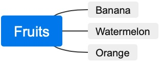

# Nut Mindmap
a vscode plugin to map text to mindmap

## Quick Start

1. open a markdown file with the extension .md
2. write as follw
<pre>
```nutmap
# Fruits
## Banana
## Watermelon
## Orange
```
</pre>

3. click the preview button on right top, and then you can see the picture as follow.



## Stand alone file
you can also use .nutmap file to gen mindmap.
1. create a file with .nutmap extesion
2. enter text like 
```
# Fruits
## Banana
## Watermelon
## Orange
```
3. click preview button on the right top, and you will get the preview svg picture.

## Release Notes

### 0.1.0 
Date: 2022-03-14
1. First version of mindmap

## Last
If this plugin make sense to you, please give me a star on github, this is very important to me. Thank you very much!

**Enjoy!**